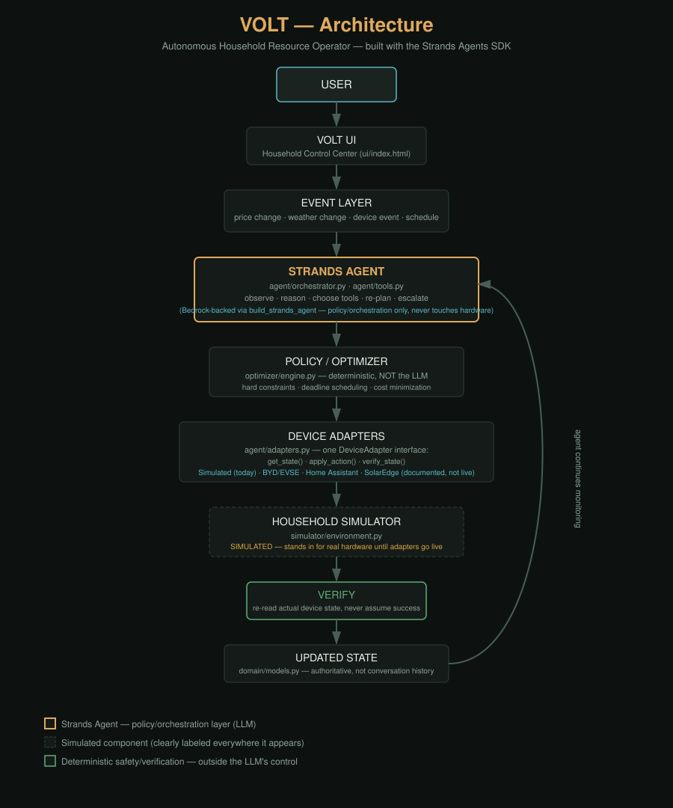

# VOLT — Autonomous Household Resource Operator

AWS Agents for Humans Hackathon 2026

**Live interactive demo:**  — also
available as a standalone repo at
https://github.com/Abdullah49645/volt-demo if you just
want the UI without the full backend.

> You don't tell VOLT when to charge your car or run your appliances. You tell it what needs to be true — and VOLT continuously figures out how to make it true.

## What this is

VOLT is not an energy dashboard, an EV scheduler, or a chatbot. The user states
**outcomes and constraints** ("EV at 80% by 7am, battery never below 30%,
minimize cost"), and VOLT continuously coordinates the household's flexible
resources (EV, battery, solar, flexible appliances) to keep that state true as
prices, weather, and schedules change — re-planning, acting, and verifying
without the user managing a schedule.

## What's actually built here, and what isn't

This was built in a sandboxed chat environment with **no AWS credentials, no
network path to AWS, and no ability to run a long-lived server**. Given that,
here's an honest breakdown:

**Real and working (tested in this repo):**
- Full domain model (`domain/models.py`) — household, devices, objectives,
  plans, events, verification status, escalations.
- A deterministic **household simulator** (`simulator/environment.py`) — EV,
  battery, solar, grid, appliances — with real physical constraints (SOC
  bounds, charge-rate limits, reserve protection, energy balance).
- A real **constrained optimizer** (`optimizer/engine.py`) — deadline-aware
  EV scheduling, solar-surplus-first battery charging, reserve protection,
  infeasibility detection (not hallucinated success).
- Real **Strands SDK tool functions** (`agent/tools.py`) — `get_household_state`,
  `run_optimizer_tool`, `apply_device_action`, `verify_device_state`,
  `request_human_decision`, etc. — with the safety-critical logic living in
  the sim/optimizer, never in the LLM layer.
- `agent/orchestrator.py::build_strands_agent()` — real `strands.Agent(...)`
  wiring to these tools and a Bedrock model ID. This is genuine production
  code; it just can't be invoked live from this sandbox.
- `tests/test_scenarios.py` — runs scenarios A–J from the spec (price spike,
  solar collapse, early EV arrival, deadline change, reserve change, device
  failure, impossible objective, mid-run preference change, post-action
  verification failure) against the real sim + optimizer + tool stack. All
  pass, including correctly flagging infeasible objectives instead of faking
  success.
- Real, **implemented** device adapter layer (`agent/adapters.py`) —
  `DeviceAdapter` is an abstract base with exactly three operations
  (`get_state`, `apply_action`, `verify_state`); `agent/tools.py`'s
  `apply_device_action` / `verify_device_state` route through it, not the
  simulator directly. See "How VOLT would see and control a real house"
  below for what's needed to make each vendor adapter live.

**Simulated, and clearly labeled as such, everywhere it appears:**
EV, battery, solar inverter, and appliance hardware, via
`SimulatedDeviceAdapter` in `agent/adapters.py`, which wraps
`simulator/environment.py`.

**Not wired up (needs real AWS access, not sandbox-feasible):**
Live Bedrock model calls, DynamoDB persistence, EventBridge-driven wakeups,
Lambda handlers, AgentCore deployment. `run_agent_cycle()` in
`agent/orchestrator.py` is a **deterministic stand-in** that drives the exact
same tool functions a live Bedrock-backed Strands agent would, following the
same OBSERVE → REASON → PLAN → ACT → VERIFY → ADAPT loop and the same system
prompt's policy — this is what let the scenario tests run end-to-end without
live model access. Swapping in `build_strands_agent()` with real AWS
credentials is the only change needed to make it live.

## How VOLT would see and control a real house

This is the part that's easy to hand-wave, so here's the actual mechanism,
per device category — all implemented as documented stubs in
`agent/adapters.py` (real API shapes, not live, since this sandbox has no
network path to any of them):

| Device | How VOLT reads it | How VOLT controls it | Real-world catch |
|---|---|---|---|
| **EV (Tesla)** | Tesla Fleet API `GET /vehicle_data` (`charge_state.battery_level`) | `POST /command/charge_start`, `set_charging_amps` | Vehicle may be asleep; a command can need a `wake_up` call first — real latency the agent's verify-after-act pattern already has to tolerate |
| **EV (other) / charger** | Wallbox REST API `GET /chargers/status/{id}` | `POST /charger/{id}/remote-action`, `maxChargingCurrent` | Requires the charger vendor's own account, separate from the EV itself |
| **Home battery, HVAC, water heater, smart-plugged appliances** | Home Assistant local REST API `GET /api/states/{entity_id}` | `POST /api/services/{domain}/{service}` | The most realistic near-term path for most households — HA already normalizes Powerwall/Enphase/thermostats/plugs behind one local API, so VOLT needs one integration (HA), not one per vendor |
| **Solar generation** | SolarEdge/Enphase monitoring API `GET /site/{id}/currentPowerFlow.json` | none — generation is read-only | Inverters typically report on a ~15 min interval, which caps how "real-time" VOLT's solar reaction can actually be, regardless of agent speed |
| **Electricity price** | A day-ahead/dynamic tariff API where the utility offers one (e.g. Agile/Awattar-style public APIs), else the household's static TOU schedule | n/a | Coverage varies a lot by utility/region — this is the integration most worth building first, since some of these APIs are public with no partnership needed |

The point of `DeviceAdapter` having exactly three methods
(`get_state`/`apply_action`/`verify_state`) is that none of this vendor
detail leaks into the agent or optimizer — `build_adapters()` in
`agent/adapters.py` is the single place that maps `"ev"` / `"battery"` to a
concrete adapter, so going from the demo to a real Tesla+HA household is a
one-line change per device, not a rewrite.

## Architecture



```
USER
 │
 ▼
VOLT UI (ui/index.html)
 │
 ▼
EVENT LAYER (price/weather/device/schedule changes)
 │
 ▼
STRANDS AGENT (agent/orchestrator.py, agent/tools.py)
 │  observe · reason · choose tools · re-plan · escalate
 ▼
POLICY / OPTIMIZER (optimizer/engine.py)
 │  hard constraints, deadline scheduling, cost minimization
 ▼
DEVICE ADAPTERS (agent/adapters.py — Tesla / Wallbox / Home Assistant /
 │                SolarEdge / simulated, behind one DeviceAdapter interface)
 ▼
HOUSEHOLD SIMULATOR (simulator/environment.py) — SIMULATED, stands in for
 │                     real hardware until adapters above are made live
 ▼
VERIFY → UPDATED STATE → AGENT CONTINUES
```

Why the split matters: the LLM/Strands layer decides *when* to re-plan, *which*
tools to call, and *when to escalate* — it never directly sets SOC or power
levels. The optimizer and sim enforce hard constraints (reserve, SOC bounds,
rate limits) regardless of what the model outputs.

## How to run

```bash
cd volt
python3 -m venv venv && . venv/bin/activate
pip install strands-agents strands-agents-tools

# Run the deterministic scenario tests (no AWS needed):
python3 tests/test_scenarios.py

# Open the interactive control center:
open ui/index.html   # or just open the file in a browser
```

To go live with a real Bedrock-backed agent:
```python
from agent.tools import VoltRuntime
from agent.orchestrator import build_strands_agent
from simulator.environment import HouseholdSimulator
from datetime import datetime

rt = VoltRuntime(HouseholdSimulator(sim_start=datetime.now()))
agent = build_strands_agent(rt, model_id="us.anthropic.claude-sonnet-4-6")
agent("A price spike just occurred. Re-evaluate the household plan.")
```
(Requires AWS credentials with Bedrock access — not available in this sandbox.)
This defaults to `us.anthropic.claude-sonnet-4-6` (Claude Sonnet 4.6 via
Bedrock's cross-region inference profile). Run
`aws bedrock list-foundation-models --region us-east-1 | grep claude` first
to confirm the exact model ID enabled on your account/region — Bedrock model
IDs occasionally shift, and `build_strands_agent()`'s `model_id` argument
can be overridden with whatever it returns.

## Connecting real devices

Device access goes through `agent/adapters.py`, never through the agent or
optimizer directly. To connect a real EV (e.g. via a Tesla-style API, or an
OCPP-compliant home charger), a real battery/HVAC (via Home Assistant), or
solar (via SolarEdge/Enphase), you fill in the corresponding adapter class
with live credentials and swap it into `build_adapters()` in that file —
nothing elsewhere in the codebase changes, since every device is accessed
through the same three-method `get_state`/`apply_action`/`verify_state`
contract. See that file for the exact endpoints each vendor integration
calls.

## Example agent lifecycle (from `tests/test_scenarios.py`, scenario E)

```
EV deadline moved to 2 hours from now
  feasible=False  violations=['EV target infeasible: needs 33.2 kWh in
  120 min, max deliverable 22.0 kWh.']
  ESCALATED -> Objective at risk under current constraints...
    options: ['Allow backup/expedited charging option (adds cost)',
              'Keep current plan and accept missed target']
```

The optimizer correctly detects the objective can't be met under current
constraints and escalates to the user rather than silently missing the
deadline or hallucinating success.

## Future real-world integrations

`TeslaAdapter`, `WallboxAdapter`, `HomeAssistantAdapter`, and
`SolarEdgeInverterAdapter` already exist in `agent/adapters.py` with real,
documented API shapes — they raise `NotImplementedError` with the exact
endpoint they'd call, since this sandbox has no network path to any of them.
Finishing one is filling in the HTTP call with a live account's credentials,
not designing an integration from scratch.

## Honesty note on novelty

VOLT isn't claiming no one has built AI energy management before. The
distinction is the interaction model: individual devices and dashboards
optimize themselves independently; VOLT lets the user specify
household-level *outcomes and constraints* and coordinates the flexible
resources continuously around those goals, re-planning and verifying as
conditions change — not a schedule the user sets once.
